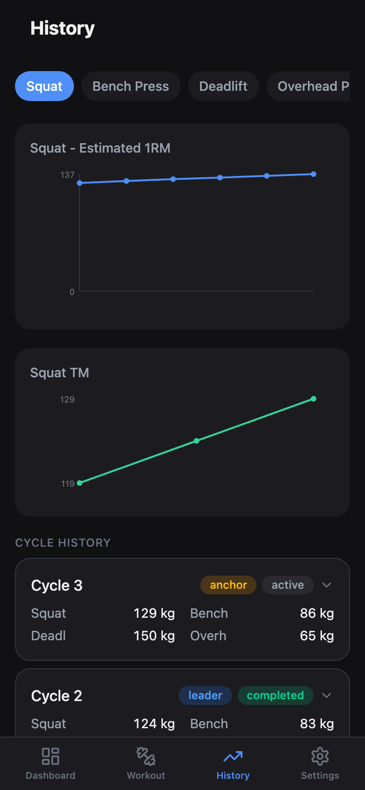

# 5/3/1 운동 기록 앱

오프라인 우선 Progressive Web App으로, **5/3/1** 근력 훈련을 계획하고 기록합니다. 구독료 없이, 어두운 테마로 헬스장에서 바로 사용할 수 있도록 설계했습니다.

> Jim Wendler의 5/3/1 프로그램을 기반으로 한 비공식 팬메이드 도구입니다. Jim Wendler와 제휴하거나 보증받은 것이 아닙니다.

<p align="center">
  
  
  
</p>

## 기능

### 핵심 운동
- **5/3/1 주기화** -- 4주 사이클(5/5/5+, 3/3/3+, 5/3/1+, 디로드)
- **리더/앵커 구조** -- 리더와 앵커 사이클 수 설정
- **종목별 설정** -- 메인 세트 방식(5/3/1 AMRAP 또는 5's PRO)과 보조 운동을 종목마다 따로 지정
- **보조 운동** -- Boring But Big / First Set Last, 세트 수 조절 가능, 사용 안 함도 선택 가능
- **워밍업 세트** -- 40%x5, 50%x5, 60%x3 자동 생성
- **디로드 건너뛰기** -- 대시보드에서 스와이프로 사이클별 4주차 생략
- **연속 블록 진행** -- 블록이 끝나면 상승된 TM으로 다음 블록이 곧바로 이어짐

### 계산 및 추적
- **1RM 계산기** -- Epley 공식 기반, N회 반복 최대 추정
- **Training Max (TM)** -- 비율 직접 설정 (75--95%)
- **AMRAP 진행 목표** -- 현재 추정 1RM 유지에 필요한 최소 반복 수 표시
- **자동 중량 계산** -- 단위(kg/lbs) 및 반올림 단위 반영
- **AMRAP 기록** -- 마지막 올아웃 세트 기록, 추정 1RM 변화 확인
- **신기록 알림** -- AMRAP에서 최고 추정 1RM 갱신 시 토스트 알림
- **TM 조정 리뷰** -- 사이클 종료 시 종목별로 TM 증가/유지/감소 선택
- **진행 차트** -- 사이클별 AMRAP 성과 시각화
- **사이클 히스토리** -- 메인/보조/액세서리까지 펼쳐 보는 사이클별 상세 기록
- **지난 기록 수정** -- 완료한 세트를 다시 열어 잘못 입력한 값 정정

### 보조 운동 및 커스터마이징
- **보조 운동 기록** -- 세트별 중량/반복 추적, 인라인 편집
- **프리셋** -- 자주 쓰는 보조 운동 저장 (push, pull, legs, core, other)
- **휴식 타이머** -- 세트 간 카운트다운
- **중도 종료** -- 기록한 내용을 유지한 채 운동을 일찍 마칠 수 있음

### 데이터 및 오프라인
- **완전한 오프라인 지원** -- Service Worker가 모든 것을 캐싱
- **데이터 내보내기/가져오기** -- JSON으로 훈련 데이터 백업, 초기 설정 화면에서 바로 복원
- **Progressive Web App** -- iPhone, Android, 데스크톱에 앱처럼 설치
- **로컬 저장만** -- 모든 데이터는 IndexedDB에 저장. 계정도, 서버도, 추적도 없음

## 나만의 앱 배포하기

정적 PWA이므로 PWA 기능(홈 화면 설치, 오프라인)을 쓰려면 **HTTPS 호스팅**이 필요합니다. 모바일에서는 `localhost`가 작동하지 않습니다.

### Vercel (추천)

1. GitHub에서 이 저장소를 **Fork**합니다: [github.com/hanjin-kim/my531](https://github.com/hanjin-kim/my531)
2. [vercel.com](https://vercel.com)에 GitHub으로 로그인합니다
3. **Add New Project** -> Fork한 저장소를 Import합니다
4. Vercel이 Vite를 자동 감지합니다 -- **Deploy** 클릭
5. 완료. HTTPS + 글로벌 CDN으로 바로 사용 가능합니다.

> SPA 라우팅과 Service Worker 캐싱은 `vercel.json`에 미리 설정되어 있습니다.

### GitHub Pages

1. 이 저장소를 Fork합니다
2. **Settings** > **Pages** > Source: **GitHub Actions** 선택
3. `.github/workflows/deploy.yml` 파일을 추가합니다:
   ```yaml
   name: Deploy
   on:
     push:
       branches: [main]
   jobs:
     deploy:
       runs-on: ubuntu-latest
       permissions:
         pages: write
         id-token: write
       steps:
         - uses: actions/checkout@v4
         - uses: actions/setup-node@v4
           with: { node-version: 20 }
         - run: npm ci && npm run build
         - uses: actions/upload-pages-artifact@v3
           with: { path: dist }
         - uses: actions/deploy-pages@v4
   ```
4. `main`에 Push하면 GitHub Actions가 자동으로 빌드 및 배포합니다.

> 참고: 커스텀 도메인이 아닌 경우 `vite.config.ts`에서 `base: '/<repo-name>/'`를 설정하세요.

## 앱으로 설치하기

**HTTPS 필수** -- 먼저 위 방법으로 배포한 후, 배포된 URL을 열어 설치합니다.

**iPhone (Safari):**
1. **Safari**에서 배포된 URL을 엽니다 (Chrome/Firefox 불가)
2. **공유** > **홈 화면에 추가** 탭
3. 이름 지정 후 **추가** 탭

**Android (Chrome):**
1. Chrome에서 열기
2. **메뉴** > **앱 설치** 탭

**데스크톱:**
1. 배포된 URL 방문
2. 주소창의 설치 아이콘 클릭

## 개발

```bash
git clone https://github.com/hanjin-kim/my531.git
cd my531
npm install
npm run dev
```

### 빌드 및 테스트

```bash
npm run build        # 프로덕션 빌드 (~111 KB gzipped)
npm test             # 69개 테스트 실행
```

## 기술 스택

| 영역 | 도구 |
|------|------|
| **UI** | React 19, TypeScript 5.7 |
| **빌드** | Vite 6 |
| **스타일** | Tailwind CSS v4 (다크 모드 전용) |
| **저장소** | Dexie.js v4 (IndexedDB) |
| **상태 관리** | Zustand v5 (일시적 UI 상태) |
| **PWA** | vite-plugin-pwa |
| **테스트** | Vitest |

## 프로젝트 구조

```
src/
├── core/              # 계산 엔진 (순수 로직, UI 의존성 없음)
│   ├── calculator.ts  # 1RM, TM, 워밍업, AMRAP 목표
│   ├── cycle-generator.ts  # 주기화 로직
│   ├── program-engine.ts   # 프로그램 라이프사이클
│   └── types.ts       # TypeScript 타입 정의
├── pages/             # 라우트 페이지
├── components/        # React 컴포넌트
├── db/                # Dexie 스키마, 리포지토리, 시딩
├── stores/            # Zustand 스토어
├── hooks/             # 커스텀 React 훅
└── App.tsx            # 라우터 설정
```

## 알려진 제한사항

- **기기당 하나의 프로그램** -- 한 번에 하나의 활성 프로그램만 사용 가능
- **클라우드 동기화 없음** -- 데이터는 100% 로컬. 기기 간 이동은 내보내기/가져오기 사용

## 기여하기

버그를 발견했거나 아이디어가 있나요? [GitHub](https://github.com/hanjin-kim/my531)에서 이슈를 열어주세요.

## 라이선스

MIT
