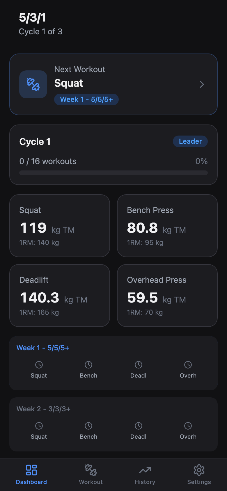
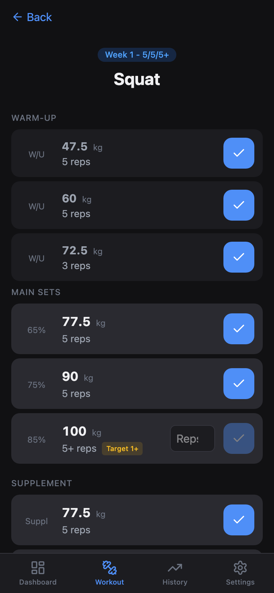
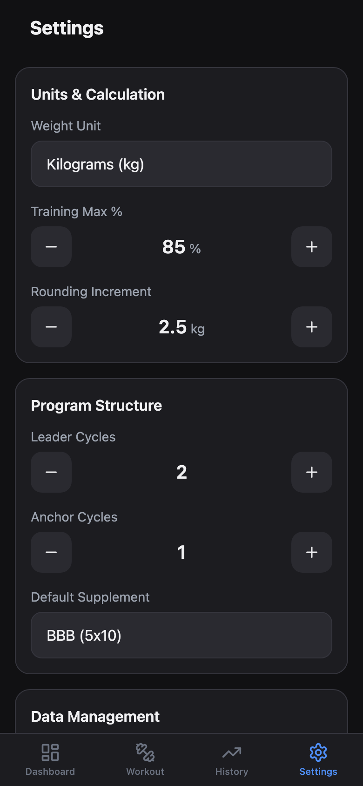

# 5/3/1 Workout Logger

[한국어](README.ko.md)

An offline-first Progressive Web App for planning and logging **5/3/1** strength training workouts. Built for lifters who want full control, zero subscriptions, and a dark theme optimized for the gym.

> Based on the 5/3/1 program by Jim Wendler. This is an unofficial, fan-made tool — not affiliated with or endorsed by Jim Wendler.

<p align="center">
  
  
  
</p>

## Features

### Core Workouts
- **5/3/1 periodization** -- 4-week cycles with 5/5/5+, 3/3/3+, 5/3/1+, and deload weeks
- **Leader/Anchor structure** -- Configure multiple leader and anchor cycles
- **7th Week Protocol** -- Test your max or deload after each cycle
- **Supplements** -- Built-in Boring But Big (5x10) and First Set Last (5x5) options
- **Warm-up sets** -- Auto-generated 40%x5, 50%x5, 60%x3

### Calculations & Tracking
- **1RM calculator** -- Epley formula with N-rep max estimates
- **Training Max (TM)** -- Set your own percentage (75--95%)
- **AMRAP progression target** -- Shows minimum reps to maintain your estimated 1RM
- **Automatic weight calculation** -- Respects your unit preference (kg/lbs) and rounding increments
- **AMRAP tracking** -- Log your all-out final set and see estimated 1RM progress
- **Progress charts** -- Visualize AMRAP gains over cycles

### Accessories & Customization
- **Accessory logging** -- Per-set weight/reps tracking with inline editing
- **Preset system** -- Save favorite accessories (push, pull, legs, core, other)
- **Rest timer** -- Countdown between sets

### Data & Offline
- **Full offline support** -- Service Worker caches everything. No connection? No problem.
- **Data export/import** -- Backup your training data as JSON
- **Progressive Web App** -- Install on iPhone, Android, or desktop for app-like experience
- **Local storage only** -- All data stored in IndexedDB. No accounts, no servers, no tracking.

## Deploy Your Own

This is a static PWA -- **you need HTTPS hosting** for PWA features (home screen install, offline mode). `localhost` won't work on mobile.

### Vercel (Recommended)

1. **Fork** this repo on [GitHub](https://github.com/hanjin-kim/my531)
2. Go to [vercel.com](https://vercel.com) and sign in with GitHub
3. Click **Add New Project** -> Import your forked repo
4. Vercel auto-detects Vite -- just click **Deploy**
5. Done. Your 5/3/1 app is live with HTTPS + global CDN.

> SPA routing and Service Worker caching are pre-configured in `vercel.json`.

### GitHub Pages

1. Fork this repo
2. Go to **Settings** > **Pages** > Source: **GitHub Actions**
3. Add `.github/workflows/deploy.yml`:
   ```yaml
   name: Deploy
   on:
     push:
       branches: [main]
   jobs:
     deploy:
       runs-on: ubuntu-latest
       permissions:
         pages: write
         id-token: write
       steps:
         - uses: actions/checkout@v4
         - uses: actions/setup-node@v4
           with: { node-version: 20 }
         - run: npm ci && npm run build
         - uses: actions/upload-pages-artifact@v3
           with: { path: dist }
         - uses: actions/deploy-pages@v4
   ```
4. Push to `main` -- GitHub Actions builds and deploys automatically.

> Note: Set `base: '/<repo-name>/'` in `vite.config.ts` if your repo name differs from the custom domain.

## Install as App

**Requires HTTPS** -- deploy first (see above), then open the deployed URL.

**iPhone (Safari):**
1. Open the deployed URL in **Safari** (Chrome/Firefox won't work)
2. Tap **Share** > **Add to Home Screen**
3. Name it, tap **Add**

**Android (Chrome):**
1. Open in Chrome
2. Tap **menu** > **Install app**

**Desktop:**
1. Visit the deployed URL
2. Click the install icon in the address bar

## Development

```bash
git clone https://github.com/hanjin-kim/my531.git
cd my531
npm install
npm run dev
```

### Build & Test

```bash
npm run build        # Production build (~111 KB gzipped)
npm test             # Run 59 tests
```

## Tech Stack

| Layer | Tools |
|-------|-------|
| **UI** | React 19, TypeScript 5.7 |
| **Build** | Vite 6 |
| **Styling** | Tailwind CSS v4 (dark mode only) |
| **Storage** | Dexie.js v4 (IndexedDB) |
| **State** | Zustand v5 (ephemeral UI state) |
| **PWA** | vite-plugin-pwa |
| **Testing** | Vitest |

## Project Structure

```
src/
├── core/              # Calculation engine (pure, no UI imports)
│   ├── calculator.ts  # 1RM, TM, warmup, AMRAP target
│   ├── cycle-generator.ts  # Periodization logic
│   ├── program-engine.ts   # Program lifecycle
│   └── types.ts       # TypeScript definitions
├── pages/             # Route pages
├── components/        # React components
├── db/                # Dexie schema, repositories, seeding
├── stores/            # Zustand stores
├── hooks/             # Custom React hooks
└── App.tsx            # Router setup
```

## Known Limitations

- **Single program per device** -- One active program at a time.
- **No cloud sync** -- Data is 100% local. Use export/import to move between devices.

## Contributing

Found a bug? Have an idea? Open an issue on [GitHub](https://github.com/hanjin-kim/my531).

## License

MIT
